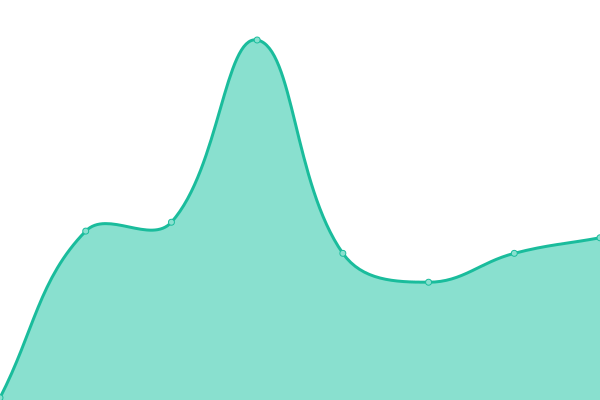
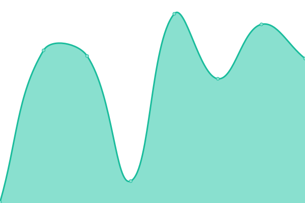

# [📈 Live Status](https://statuspage.soroco.com): <!--live status--> **🟧 Partial outage**

This repository contains the open-source uptime monitor and status page for [Soroco](https://soroco.com), powered by [Upptime](https://github.com/upptime/upptime).

With [Upptime](https://upptime.js.org), you can get your own unlimited and free uptime monitor and status page, powered entirely by a GitHub repository. We use [Issues](https://github.com/soroco/statuspage/issues) as incident reports, [Actions](https://github.com/soroco/statuspage/actions) as uptime monitors, and [Pages](https://statuspage.soroco.com) for the status page.

<!--start: status pages-->
<!-- This summary is generated by Upptime (https://github.com/upptime/upptime) -->
<!-- Do not edit this manually, your changes will be overwritten -->
<!-- prettier-ignore -->
| URL | Status | History | Response Time | Uptime |
| --- | ------ | ------- | ------------- | ------ |
|  [Soroco Azure Cloud](https://www.google.com) | 🟩 Up | [soroco-azure-cloud.yml](https://github.com/soroco/statuspage/commits/HEAD/history/soroco-azure-cloud.yml) | 

 105ms
     
 | 

<a href="https://statuspage.soroco.com/history/soroco-azure-cloud">100.00%</a>
    

|  [Cluster eastus1-lts](https://en.wikipedia.org) | 🟩 Up | [cluster-eastus1-lts.yml](https://github.com/soroco/statuspage/commits/HEAD/history/cluster-eastus1-lts.yml) | 

 121ms
     
 | 

<a href="https://statuspage.soroco.com/history/cluster-eastus1-lts">100.00%</a>
    

|  [Scout Portal](https://news.ycombinator.com) | 🟥 Down | [scout-portal.yml](https://github.com/soroco/statuspage/commits/HEAD/history/scout-portal.yml) | 

 287ms
     
 | 

<a href="https://statuspage.soroco.com/history/scout-portal">99.87%</a>
    

|  [PostgreSQL DB](https://thissitedoesnotexist.koj.co) | 🟥 Down | [postgre-sql-db.yml](https://github.com/soroco/statuspage/commits/HEAD/history/postgre-sql-db.yml) | 

 0ms
     
 | 

<a href="https://statuspage.soroco.com/history/postgre-sql-db">0.00%</a>
    

<!--end: status pages-->

[**Visit our status website →**](https://statuspage.soroco.com)

## 📄 License

- Powered by: [Upptime](https://github.com/upptime/upptime)
- Code: [MIT](./LICENSE) © [Anand Chowdhary](https://anandchowdhary.com), supported by [Pabio](https://pabio.com)
- Data in the `./history` directory: [Open Database License](https://opendatacommons.org/licenses/odbl/1-0/)
